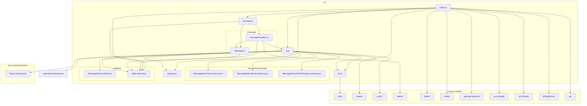

# TypeScript Graph

```bash
tsg vue/src/planning/LenseQuery.ts
```


```mermaid
flowchart
    subgraph src["src"]
        src/openapi.ts["openapi.ts"]
        src/db.ts["db.ts"]
        src/ai.ts["ai.ts"]
        src/message.ts["message.ts"]
        src/index.ts["index.ts"]
        subgraph src/json//schema//bundle["/json-schema-bundle"]
            src/json//schema//bundle/MessageParseText.schema.json["MessageParseText.schema.json"]
            src/json//schema//bundle/MessageDefineWord.schema.json["MessageDefineWord.schema.json"]
            src/json//schema//bundle/MessageParseTextToForeign.schema.json["MessageParseTextToForeign.schema.json"]
        end
        subgraph src/schema["/schema"]
            src/schema/MessageUnion.schema.ts["MessageUnion.schema.ts"]
            src/schema/Main.schema.ts["Main.schema.ts"]
        end
        subgraph src/message["/message"]
            src/message/Message.ts["Message.ts"]
            src/message/messageHandlers.ts["messageHandlers.ts"]
        end
    end
    subgraph node//modules["node_modules"]
        node//modules/knex/types/index.d.ts["knex"]
        node//modules/openai/index.d.ts["openai"]
        node//modules/uuidv7/dist/index.d.ts["uuidv7"]
        node//modules/openai/resources/index.d.ts["openai"]
        node//modules/dotenv/config.d.ts["dotenv"]
        node//modules/fastify/fastify.d.ts["fastify"]
        node//modules/openapi//backend_/index.d.ts["openapi-backend"]
        node//modules/csv//stringify/dist/esm/sync.d.ts["csv-stringify"]
        node//modules/ajv//formats/dist/index.d.ts["ajv-formats"]
        node//modules///fastify/cors/types/index.d.ts["@fastify/cors"]
        node//modules/ajv/dist/ajv.d.ts["ajv"]
    end
    subgraph json//schema/schema["json-schema/schema"]
        json//schema/schema/Word.schema.json["Word.schema.json"]
    end
    src/db.ts-->node//modules/knex/types/index.d.ts
    src/ai.ts-->node//modules/openai/index.d.ts
    src/ai.ts-->src/openapi.ts
    src/ai.ts-->openapi//resolved.json
    src/ai.ts-->src/db.ts
    src/ai.ts-->node//modules/uuidv7/dist/index.d.ts
    src/ai.ts-->json//schema/schema/Word.schema.json
    src/ai.ts-->src/json//schema//bundle/MessageParseText.schema.json
    src/ai.ts-->src/json//schema//bundle/MessageDefineWord.schema.json
    src/ai.ts-->src/json//schema//bundle/MessageParseTextToForeign.schema.json
    src/ai.ts-->src/schema/MessageUnion.schema.ts
    src/ai.ts-->src/schema/Main.schema.ts
    src/message/Message.ts-->src/schema/Main.schema.ts
    src/message/messageHandlers.ts-->node//modules/openai/resources/index.d.ts
    src/message/messageHandlers.ts-->src/ai.ts
    src/message/messageHandlers.ts-->src/schema/Main.schema.ts
    src/message/messageHandlers.ts-->src/message/Message.ts
    src/message.ts-->src/message/Message.ts
    src/message.ts-->src/message/messageHandlers.ts
    src/message.ts-->src/schema/Main.schema.ts
    src/index.ts-->node//modules/dotenv/config.d.ts
    src/index.ts-->node//modules/fastify/fastify.d.ts
    src/index.ts-->node//modules/openapi//backend_/index.d.ts
    src/index.ts-->src/db.ts
    src/index.ts-->src/openapi.ts
    src/index.ts-->node//modules/csv//stringify/dist/esm/sync.d.ts
    src/index.ts-->node//modules/ajv//formats/dist/index.d.ts
    src/index.ts-->src/ai.ts
    src/index.ts-->node//modules///fastify/cors/types/index.d.ts
    src/index.ts-->node//modules/ajv/dist/ajv.d.ts
    src/index.ts-->src/schema/Main.schema.ts
    src/index.ts-->src/message.ts
```
